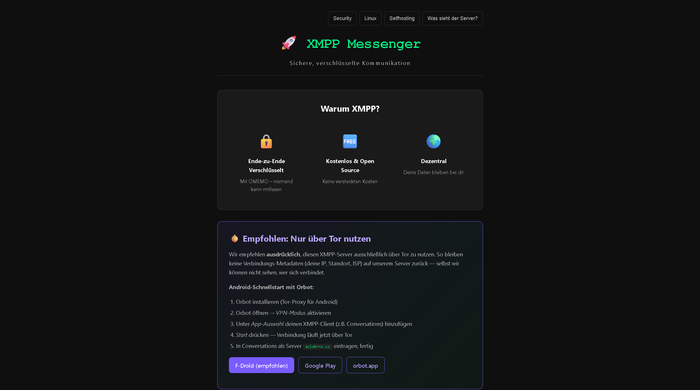

# acidbrns.cc — Self-Hosted XMPP Account Service

A privacy-first web service to self-register and manage accounts on a self-hosted
[Prosody](https://prosody.im) XMPP server — **server-side rendered, completely
JavaScript-free**, with self-hosted bot protection and no third-party trackers.

[](https://github.com/acidboonrs/acidbrns.cc/actions/workflows/ci.yml)
[](LICENSE)


🔗 **Live:** [acidbrns.cc](https://acidbrns.cc) · also reachable as a Tor onion service
📐 **Design:** [Architecture & Security](ARCHITECTURE.md) ([Deutsch](ARCHITECTURE.de.md))

<!-- Add a screenshot of the registration page here, e.g.:

-->

## Why it's interesting

- **No JavaScript, no third parties.** Pages are server-side rendered; the
  registration flow works in text browsers and Tor Browser on "safest". No
  Cloudflare, no Google, no analytics, no tracking cookies.
- **Self-hosted bot protection.** A server-signed, single-use math captcha plus a
  honeypot — instead of an external CAPTCHA service.
- **Defense in depth.** Hardened edge proxy + encrypted tunnel to an isolated
  backend, strict CSP/HSTS, DB-backed rate limiting & IP bans, least-privilege
  account provisioning via a validated wrapper, encrypted-at-rest database.
- **Actually deployed.** Running in production at
  [acidbrns.cc](https://acidbrns.cc), with CI on every push.

See **[ARCHITECTURE.md](ARCHITECTURE.md)** for the full security design.

## Tech stack

Python · Flask (Jinja SSR) · gunicorn · PostgreSQL · Prosody (XMPP) ·
nginx · WireGuard · Tor · Let's Encrypt

## Features

- Web registration, account management and password reset — all JS-free
- Dual write: every account is provisioned in PostgreSQL **and** Prosody atomically
- OMEMO end-to-end encryption, HTTP file upload, MAM, multi-device (Carbons)
- bcrypt password hashing, parametrized SQL, fail-closed validation
- Clearnet + Tor onion mirror; SPF/DKIM/DMARC-protected mail for resets

## Project layout

```
backend/      Flask app (app.py) + Jinja templates (SSR, JS-free)
config/       nginx + Prosody reference configs, hardening snippet
scripts/      install script, DB schema, validated prosodyctl wrapper, sudoers
frontend/     static assets (privacy policy, onion info, styles, PGP keys)
tools/        small self-hosted developer tools (hash, base64, regex, …)
docs/         setup & operations guides
tests/        unit tests for validation & bot-protection helpers
```

## Quick start

- **Setup in 5 steps:** [QUICKSTART.md](QUICKSTART.md)
- **Detailed install & operations:** [docs/INSTALL.md](docs/INSTALL.md)
- **Cloudflare DNS:** [docs/CLOUDFLARE_SETUP.md](docs/CLOUDFLARE_SETUP.md)

## Development

```bash
cd backend
python3 -m venv venv && source venv/bin/activate
pip install -r requirements.txt
cp .env.example .env        # fill in values
python app.py               # dev server on :5000
```

Run the checks (same as CI):

```bash
pip install pytest ruff
ruff check backend tests conftest.py
pytest -q
```

## Security

Found a vulnerability? Please report it privately — see
[SECURITY.md](SECURITY.md).

## License

[MIT](LICENSE) © acidboonrs
